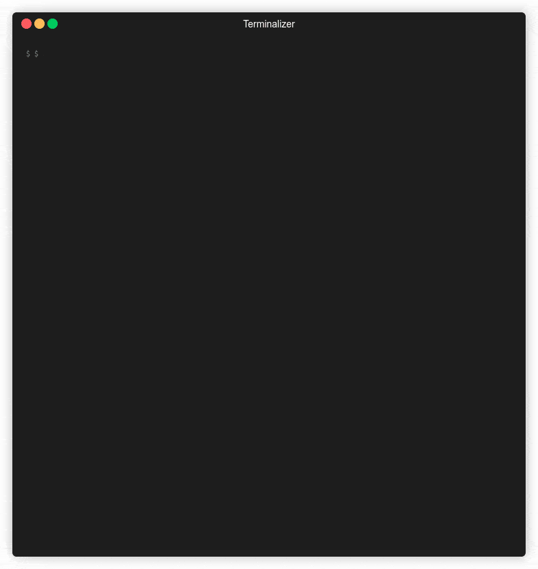

# Standardized Developer-Friendly Data Modeling with LinkML

###### Bart Kleijngeld | June 20th, 2024

---

## Hello :wave:

---

- My name is Bart Kleijngeld...
* :triangular_ruler: Data Architect
* :man_technologist: Software Developer

* I work at Alliander, one of the Dutch electrical grid operators.

---

## Data Challenges

---

### Data Management within Alliander

---

We have a lot of data...
* and a lot of teams.

---
<!-- _class: with-bullets -->

Data and solutions emerge from everywhere, and managing it is a challenge:

* What does the data mean?
* How can the data be used (responsibly)?
* Who owns the data?
* Etc.

---

How can we deal with this?
* We need to have a scalable way to produce data in a standardized manner.

---

### Sharing Data with Other Organisations

---

Not just within the organisation do we face data challenges.

---
<!-- _class: with-bullets -->

As a grid operator, we have major challenges:
* Sustainability deadlines
* Network congestion
* Sesource scarcity
* Etc.

---

Collaboration with other organisations is becoming increasingly important to tackle these challenges.
* Data sharing is a vital part of that.
* Formal data models and standardization are essential to enable this.

---

We want FAIR data!

---

## The IEC Common Information Model (CIM)

---

The CIM is an information model that's the result of decades long international collaboration.

---
<!-- _class: with-bullets -->

It's a very large object oriented UML model in the Sparx Enterprise Architect application:
* Classes represent entities
* Classes have attributes.
* Between classes there exist various types of relationships

---

It provides a great vocabulary for speaking the same 'data language' between grid operators.
* But Enterprise Architect poses issues.

---
<!-- _class: with-bullets -->

- Vendor lock-in
* Top-down way of working
* No Linked Data compatibility
* Hard to interoperate with other tools
* Hard to do version management and CI/CD automation
* Heavily disliked by developers.

---

How can we utilize this great standard such that it will be useful and adopted by developers?

---

## First attempt: SHACL and OWL

---

There is also a OWL version of the CIM
* It is generated from the UML.

---

It's not perfect, but at least we have URIs which identify CIM model elements.

---

### The Idea

---
<!-- _class: with-bullets -->

- Teams develop their own data models in SHACL.
* Standardization is achieved through SHACL targeting CIM URIs.
* We would write code generators...
    * And by "we", I mean "I".

---

### Challenges

---
<!-- _class: with-bullets -->

Many challenges arose:
* Business minded people failed to understand the necessity of formal, machine readable models.
* Developers often don't understand the need for information standardization.
* SHACL and RDF were a hard sell on developers in terms of syntax and complexity.

---

## Second attempt: LinkML

---

Facing these hardships, I reviewed my notes and uncovered a bookmark I wanted to take a closer look at.
* It was the LinkML website.

---

Turns out LinkML is literally what I was aiming to build...
* But better!

---

### The Idea, Revised

---
<!-- _class: with-bullets -->

- Teams develop their own data models in LinkML.
* Standardization is achieved through mapping to CIM URIs.
* We can leverage existing generators, as well as bake our own...
    * And by "we", I mean "we".

---
<!-- _class: with-bullets -->

This works better with LinkML:

* One language, and accessible to developers as well!
* Standardization and Linked Data are baked into the language.
* It's code, so automation, transformations, CI/CD and versioning are all a lot easier.

---

## Work Done

---

The simple, machine readable nature of LinkML makes it very easy to do cool things.

---

### The CGMES LinkML Schemas

---

CGMES is an exchange standard based on the CIM.
* I've written a script that has generated a LinkML schema for each CGMES profile.

---
<!-- _class: with-bullets -->

Resources:

- The [script](https://github.com/alliander-opensource/cimrdfs2linkml) that generates the LinkML schemas.
- The [LinkML schemas](https://github.com/alliander-opensource/cgmes-profiles).
- The automatically generated [documentation](https://alliander-opensource.github.io/cgmes-profiles/).

---

### The CIM LinkML Schemas

---

Similarly, I've generated LinkML schemas for the entire CIM.
* It is based on the official Sparx Enterprise Architect project.

---
<!-- _class: with-bullets -->

Resources:

- The [script](https://github.com/bartkl/cim-to-linkml) that generates the LinkML schemas.
- The [LinkML schemas](https://github.com/alliander-opensource/cim-linkml).
- The documentation hasn't been generated yet.

---

### Profiler

---

Creating data models based on enormous standard models such as the CIM can be very hard and tricky.

---

Ritger Teunissen has built a CLI profiler that makes it easy to create schemas based on a list of classes.
* The profiler will recursively fetch all dependencies.

---

---
<!-- _class: align-center -->

\*

*  Thanks for listening!